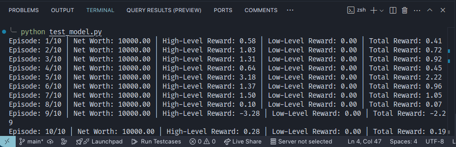

# MacroHFT Indian Equity Model

## Overview
The **MacroHFT Indian Equity Model** is a reinforcement learning-based system designed to trade in the Indian stock market. The model operates in a hierarchical structure, where multiple subagents make decisions in different environments, and a hyperagent aggregates their outputs along with past experiences to predict whether to **Hold, Buy, or Sell**.

## Architecture
The model consists of two primary reinforcement learning environments:

1. **High-Level Environment (`high_level_env.py`)**
   - Manages overall trading strategy.
   - Decides when to enter or exit trades using a high-level reinforcement learning agent.
   - Uses observations from market indicators such as OHLCV, SMA, EMA, and price trends.
   - Directs actions to the low-level environment for more granular execution.

2. **Low-Level Environment (`low_level_env.py`)**
   - Handles finer trading execution details (partial buys/sells).
   - Works within a set number of steps for each high-level action.
   - Helps optimize trade entry and exit points.

A **DQN-based Hyperagent** is used to learn from the decisions of the subagents and historical data, refining the overall trading strategy over time.

## Features
- **Hierarchical Reinforcement Learning:**
  - High-level agent makes strategic decisions (buy/sell/hold).
  - Low-level agent executes trades in smaller steps to optimize profitability.
- **Deep Q-Network (DQN) Agent (`dqn_agent.py`)**
  - Neural network for predicting optimal actions.
  - Experience replay for stable learning.
  - Epsilon-greedy strategy for exploration vs. exploitation.
- **Preprocessing Module (`preprocess.py`)**
  - Loads and normalizes stock market data.
  - Handles missing values and feature scaling.
  - Splits data into training, validation, and test sets.
- **Training Module (`train_model.py`)**
  - Implements reinforcement learning with experience replay.
  - Updates target networks periodically.
  - Saves trained models at set intervals.
- **Stock Market Data**
  - Uses hourly data of Indian equities (e.g., **HDFCBANK**).
  - Features include **OHLCV**, **SMA**, **EMA**, **volatility**, and **price trends**.

## Installation
### Requirements
Ensure you have the necessary dependencies installed:
```bash
pip install -r requirements.txt
```

### Required Libraries
- `scikit-learn`
- `numpy`
- `pandas`
- `gym`
- `torch`
- `matplotlib`

## Usage
### Preprocess Data
Before training, preprocess the stock data:
```bash
python preprocess.py
```

### Train the Model
Run the training script to train the high-level and low-level agents:
```bash
python train_model.py
```

### Evaluate the Model
Once trained, the model can be evaluated using the test dataset.
```bash
python test_model.py
```

## File Structure
```
macroHFT_indian_equity/
│-- Data/                         # Processed stock market data
│-- Environment/
│   │-- high_level_env.py         # High-level RL environment
│   │-- low_level_env.py          # Low-level RL environment
│-- Models/
│   │-- dqn_agent.py              # DQN Agent for decision making
│-- Preprocessing/
│   │-- preprocess.py             # Data preprocessing and normalization
│-- train_model.py                # Model training script
│-- requirements.txt              # Dependencies
│-- README.md                     # Project documentation
```

## Future Enhancements
- Integrating more technical indicators (e.g., **MACD, RSI**).
- Implementing **transformer-based RL models** for improved performance.
- Expanding to multiple Indian equities beyond **HDFCBANK**.
- Enhancing the hyperagent with **meta-learning techniques**.

## Results

### High-Level vs Low-Level Rewards


### Terminal Output



## License
This project is open-source and available under the MIT License.

